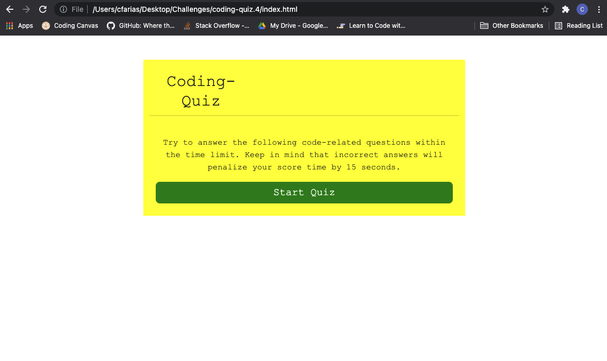

# coding-quiz.4
AS A coding boot camp student\
I WANT to take a timed quiz on JavaScript fundamentals that stores high scores\
SO THAT I can gauge my progress compared to my peers

GIVEN I am taking a code quiz\
WHEN I click the start button\
THEN a timer starts and I am presented with a question\
WHEN I answer a question\
THEN I am presented with another question\
WHEN I answer a question incorrectly\
THEN time is subtracted from the clock\
WHEN all questions are answered or the timer reaches 0\
THEN the game is over\
WHEN the game is over\
THEN I can save my initials and score

I have put together a simple 5 question quiz on the topic of JavaScript. First click the start button to begin, then click the answer you think is correct for each question, if wrong you will lose time on the timer, at the end you will enter your intials and save them to the highscore page based on the time you finished with.

